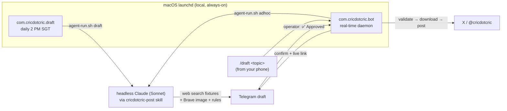

# cricdotcric — an autonomous cricket-tweeting agent

[](https://nodejs.org)
[](test/)
[](LICENSE)
[](https://x.com/cricdotcric)

A production automation that runs a **real, live X/Twitter account**
([@cricdotcric](https://x.com/cricdotcric)): every day a **headless Claude agent**
finds a cricket fixture, writes a tweet in a specific editorial voice, sources a
rule-compliant match photo, and sends a draft to **Telegram**. The operator taps
**✅ Approve** and a real-time bot posts it to X — within about a second.

It runs entirely on a personal Mac (macOS `launchd`) on a Claude Pro subscription —
**no cloud, no paid API, no server.** Every post is human-approved.

> **This repo is a portfolio piece.** It's intentionally readable end-to-end and
> shows how I design an LLM agent for a real, ongoing job: bounded scope, a
> human-in-the-loop safety gate, deterministic plumbing around the model,
> idempotent state, tests, and spec-driven development. **Reviewers: jump to
> [👀 For Reviewers](#-for-reviewers).**

---

## What it does

- **Curated coverage, not "all cricket."** The agent only drafts for series listed
  as `active` in [`content/coverage.json`](content/coverage.json) — a small,
  editable watchlist that bounds editorial quality and model usage.
- **Two ways to draft, both headless Claude (Sonnet):**
  - **Daily 2 PM** — a `launchd` job finds a due fixture (preview before, review
    after) via web search and drafts it.
  - **Ad-hoc from a phone** — text the bot `/draft <topic>` and it drafts that.
- **Strict, enforced editorial rules** — a funny/editorial voice, and images that
  must be live on-field action, in the correct **format kit** (Test whites vs ODI
  colours vs T20 vs franchise), of the **same two teams**, from the ongoing match
  or within 3 years. The agent *views* each candidate image and self-rejects
  off-brief ones.
- **Human-in-the-loop.** Nothing posts without an explicit Telegram approval;
  rejections/corrections round-trip back to the agent.
- **Idempotent & safe.** Posting state is recorded so the same item never
  double-posts, and the Telegram poll offset is persisted so approvals aren't
  reprocessed.

## Architecture



The **model does the judgment** (find the fixture, write the copy, pick + verify
the image); **deterministic Node does the side effects** (OAuth to X, media upload,
state, dedupe, Telegram I/O). The two are cleanly separated so each is testable and
the risky parts are boring.

## What this demonstrates

| Area | In this repo |
|---|---|
| **LLM agent design** | A skill + subagent encode the task; the model is scoped and given tools, not free rein ([`.claude/`](.claude)) |
| **Human-in-the-loop** | Telegram approval gate; the agent proposes, a human disposes ([`scripts/telegram-bot.js`](scripts/telegram-bot.js)) |
| **Headless LLM automation** | `claude -p` driven by `launchd`, auth via a long-lived token ([`scripts/agent-run.sh`](scripts/agent-run.sh)) |
| **Tool building** | Image sourcing + validation against editorial rules ([`scripts/find-image.js`](scripts/find-image.js)) |
| **Idempotency & state** | No double-posts, persisted poll offset ([`scripts/lib/`](scripts/lib)) |
| **Testing** | `node --test` unit suite for all pure logic ([`test/`](test)) |
| **Spec-driven delivery** | Design spec + step-by-step plan committed *before* code ([`docs/superpowers/`](docs/superpowers)) |
| **Ops maturity** | Runbook with real troubleshooting, `launchd` install notes ([`docs/RUNBOOK.md`](docs/RUNBOOK.md)) |
| **Legacy migration** | Ported from a previous "OpenClaw" system ([`archive/`](archive)) |

## Project structure

```
.claude/
  skills/cricdotcric-post/SKILL.md   # the editorial "brain": workflow + strict rules
  agents/cricdotcric.md              # subagent that runs the skill
scripts/
  agent-run.sh                       # headless-Claude runner (draft | adhoc | check-and-post)
  telegram-bot.js                    # always-on daemon: real-time approvals + /draft
  find-image.js                      # Brave image search + download validation
  x-post.js                          # X API v2 client (OAuth1, media upload)
  post-queue.js / check-and-post.js  # batch + one-shot posters (manual/backup)
  telegram.js                        # Telegram CLI (send / poll / message / selftest)
  config.js                          # secrets loader (X + Telegram + Brave)
  lib/                               # pure, unit-tested helpers
    queue-item.js  state.js  dates.js  telegram-parse.js  posting.js
content/
  coverage.json                      # the series watchlist (what to cover)
  queue.json                         # draft/approval buffer (items carry a status)
deploy/launchd/                      # the two launchd jobs + install/ops notes
docs/
  RUNBOOK.md                         # operations + troubleshooting (handoff)
  architecture.md  scheduler.md  editorial-template.md
  superpowers/specs/  superpowers/plans/   # the design spec and implementation plan
test/                                # node --test unit suite
state/                               # runtime state + logs (gitignored)
archive/                             # retired artifacts from the pre-migration system
```

## Running it

Requires Node ≥ 20 (zero npm dependencies — native `fetch`) and, for live posting,
credentials in `~/.cricdotcric/secrets.json`:

```json
{
  "twitterAccounts": { "cricdotcric": { "apiKey": "...", "apiSecret": "...", "accessToken": "...", "accessTokenSecret": "..." } },
  "telegram": { "botToken": "...", "chatId": "..." },
  "brave": { "apiKey": "..." }
}
```

```bash
npm test               # run the unit suite (no credentials needed)
npm run verify         # verify X auth
npm run tg:selftest    # verify Telegram connectivity
npm run post:due:dry   # dry-run the poster against the queue
```

Scheduling is two `launchd` jobs — see [`deploy/launchd/README.md`](deploy/launchd/README.md)
to install, and [`docs/RUNBOOK.md`](docs/RUNBOOK.md) to operate.

---

## 👀 For Reviewers

Short on time? This is the 10-minute path through the repo, in order:

1. **[`docs/superpowers/specs/`](docs/superpowers/specs)** — the design spec. Written
   and committed *before* any code. Shows how I scope an agent (watchlist not
   "all cricket"), pick a human-in-the-loop model, and reason about trade-offs.
2. **[`.claude/skills/cricdotcric-post/SKILL.md`](.claude/skills/cricdotcric-post/SKILL.md)**
   — how the agent is actually programmed: the workflow and the *strict, enforced*
   editorial rules. This is the heart of the agent design.
3. **[`scripts/lib/`](scripts/lib)** + **[`test/`](test)** — the deterministic core:
   validation, idempotent state, Telegram-reply parsing — each a small, single-
   purpose, unit-tested module. Read a module and its test side by side.
4. **[`scripts/telegram-bot.js`](scripts/telegram-bot.js)** + **[`scripts/agent-run.sh`](scripts/agent-run.sh)**
   — the runtime: a real-time long-polling daemon and the headless-Claude runner.
   The seam where the LLM meets scheduled, deterministic execution.
5. **[`docs/RUNBOOK.md`](docs/RUNBOOK.md)** — how it's operated, including the actual
   failures hit during build-out and their fixes (auth token shadowed by an expired
   keychain entry; `launchd` PATH missing `node`). Shows real operational judgment.

**Design decisions worth noting**
- **Bounded autonomy.** The model has a job, tools, and rules — not an open mandate.
  Coverage is an explicit watchlist; every post is human-approved.
- **Judgment vs. side effects are separated.** The LLM decides; plain Node performs
  irreversible actions (posting), so the risky code is deterministic and testable.
- **Fail safe, not silent.** On any failure an item is left `pending` and the
  operator is told — the system never guesses or half-posts.
- **Idempotent by construction.** State is recorded before it's trusted; re-runs and
  restarts are safe.
- **Small, focused files.** Each module has one responsibility and a matching test.

**Commit history is part of the story** — it's incremental and conventionally
messaged (spec → plan → TDD modules → integration → docs), so the *process* is
reviewable, not just the result.

---

## Notes

- `@cricdotcric` is an **X Premium** account, so tweets can exceed 280 characters
  when the detail earns it (the validator caps at 25,000).
- The drafting model is pinned to **Sonnet** in `scripts/agent-run.sh`; switch to
  Opus with a one-line change.
- No secrets live in this repo — credentials are read from `~/.cricdotcric/`.

## License

[MIT](LICENSE) © 2026 Haryy Venky
